# TalentFlow AI — Smart ATS Hiring Suite

> AI-Powered Hiring. Smarter Decisions. Better Teams.

A production-grade Applicant Tracking System with AI resume parsing, semantic candidate scoring, explainable recommendations, and a full recruitment pipeline — built as the Namaah Pvt Ltd full-stack intern assignment.

---

## Live Demo

| Service | URL |
|---|---|
| **Frontend** | [https://talent-flow-ai-the-sunny-sharma.vercel.app](https://talent-flow-ai-the-sunny-sharma.vercel.app) |
| **API Gateway** | [https://api-gateway-production.up.railway.app](https://api-gateway-production.up.railway.app) |
| **AI Service** | [https://ai-service-production-645a.up.railway.app](https://ai-service-production-645a.up.railway.app) |

### Demo Accounts

| Role | Email | Password |
|---|---|---|
| Admin | `admin@talentflow.ai` | `Admin@123` |
| Recruiter | `recruiter@talentflow.ai` | `Recruiter@123` |
| Hiring Manager | `hiring@talentflow.ai` | `Manager@123` |

> Run `node seed.js` inside `backend/api-gateway/` to create these accounts + sample data.

---

## Screenshots

### Landing Page
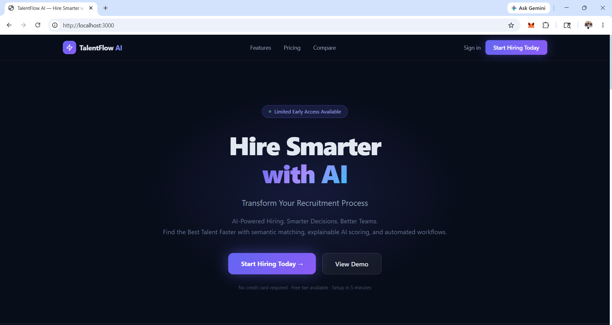
*Public marketing page with "Hire Smarter with AI" hero, feature highlights, pricing, and CTA buttons.*

---

### Dashboard
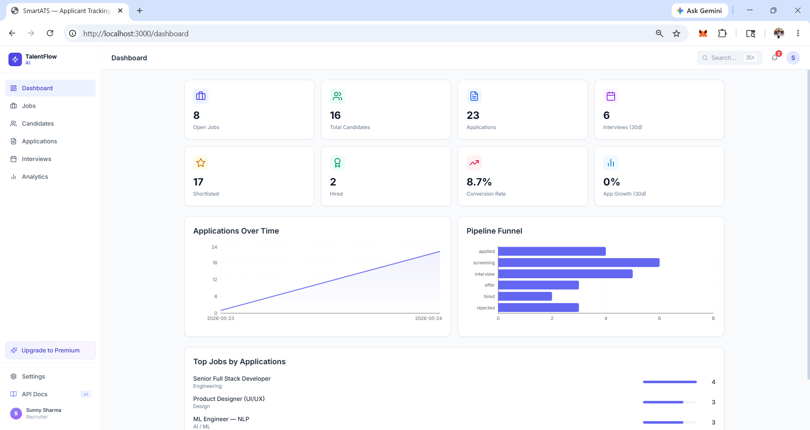
*Recruitment command centre — live KPIs (Open Jobs, Total Candidates, Applications, Interviews, Shortlisted, Hired, Conversion Rate, App Growth), Applications Over Time line chart, Pipeline Funnel bar chart, and Top Jobs by Applications.*

---

### Jobs
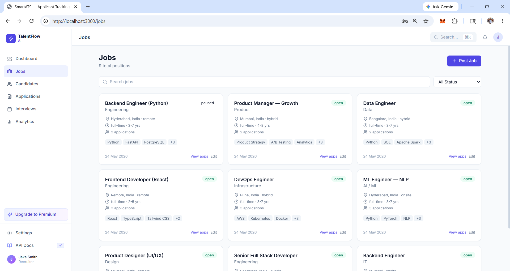
*Job board with card layout — department, location, work mode, experience range, required skills, application count, and status badge (open / paused). One-click "Post Job" and per-card Edit / View apps actions.*

---

### Applications — Kanban Pipeline
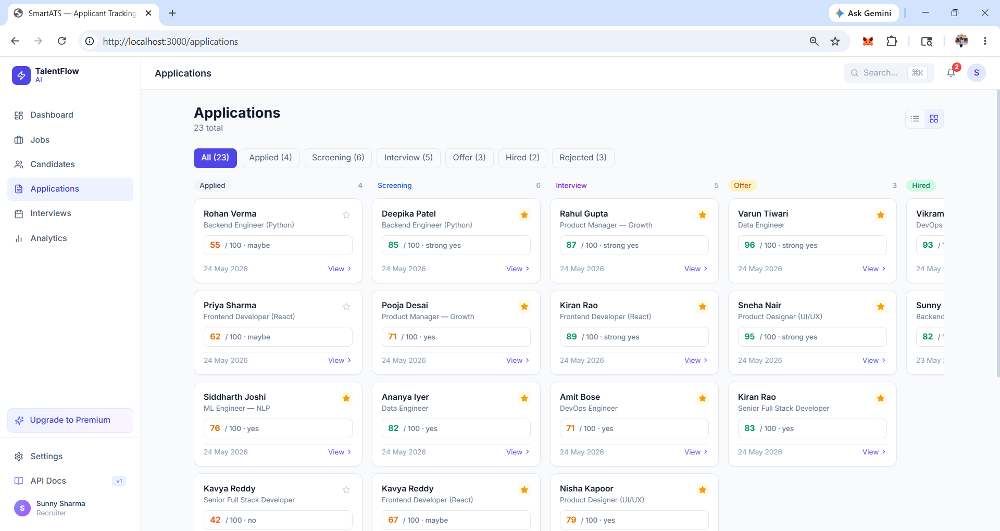
*Kanban-style pipeline grouping all applications by stage (Applied → Screening → Interview → Offer → Hired → Rejected). Each card shows candidate name, role, AI score out of 100, recommendation label, and applied date. Filter tabs show per-stage counts.*

---

### Application Detail — AI Assessment
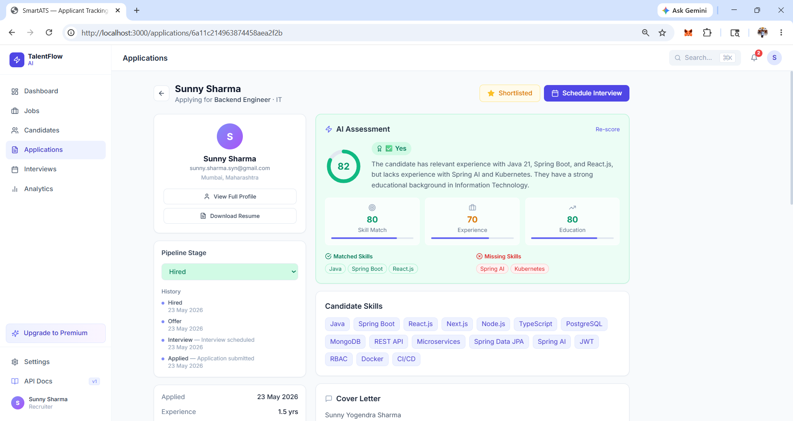
*Individual application view with the full AI Assessment panel: circular score gauge, skill-match verdict (Yes / Maybe / No), plain-English explanation, sub-scores for Skill Match / Experience / Education, matched skills chips (green), missing skills chips (red), pipeline stage selector with history, and one-click Shortlist / Schedule Interview actions.*

---

### Semantic Ranking
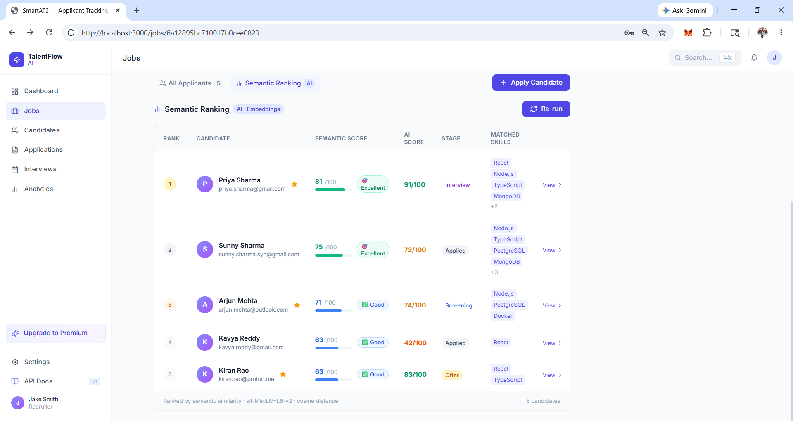
*Per-job AI ranking tab — candidates ordered by semantic similarity score. Shows rank, candidate name & email, semantic score bar, AI score badge (Excellent / Good / …), current stage, and top matched skills.*

---

### Candidate Profile
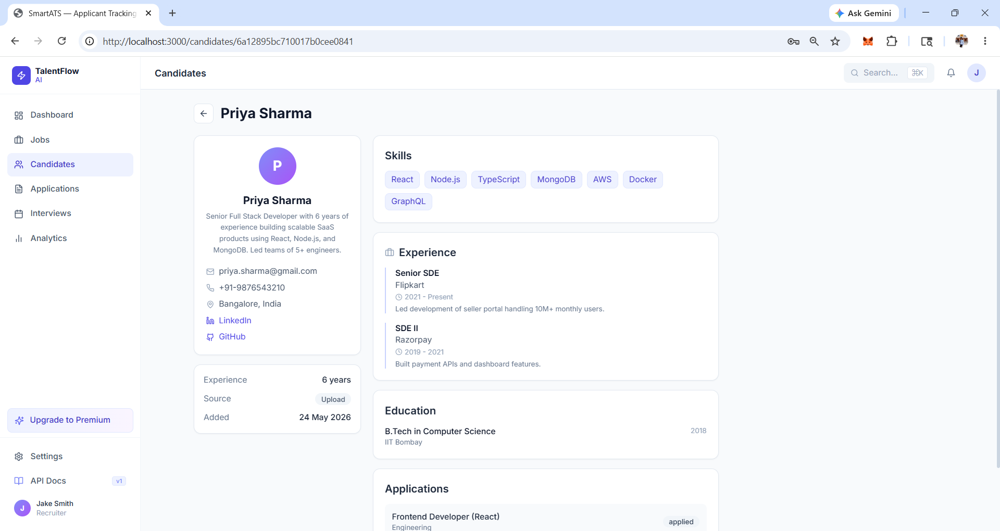
*Full candidate profile: avatar, bio, contact details (email, phone, location, LinkedIn, GitHub), experience in years, source, and date added. Right panel shows Skills chips, Experience timeline, Education, and linked Applications with current stage.*

---

### Upload Resume Modal
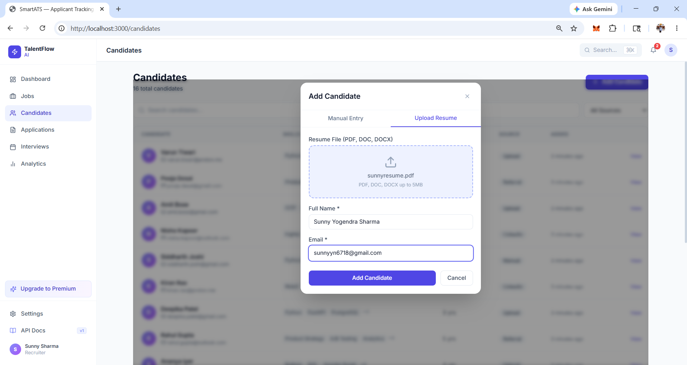
*"Add Candidate" modal with two tabs — Manual Entry and Upload Resume. The upload tab has a drag-and-drop zone (PDF, DOC, DOCX up to 5 MB) and auto-populates Full Name and Email fields after AI parsing.*

---

### Interviews
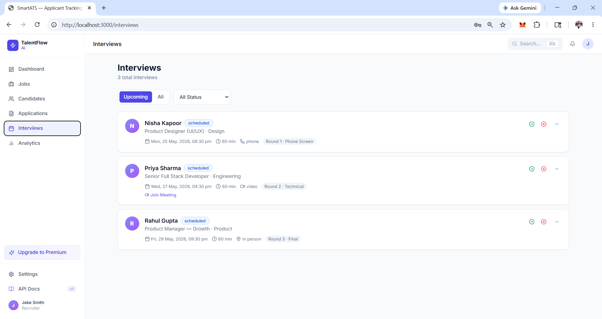
*Upcoming interviews list with candidate avatar, name, role, department, scheduled date/time, duration, format (phone / video / in person), round label, and one-click confirm (✓) or cancel (✗). Video interviews show a "Join Meeting" link.*

---

### Analytics
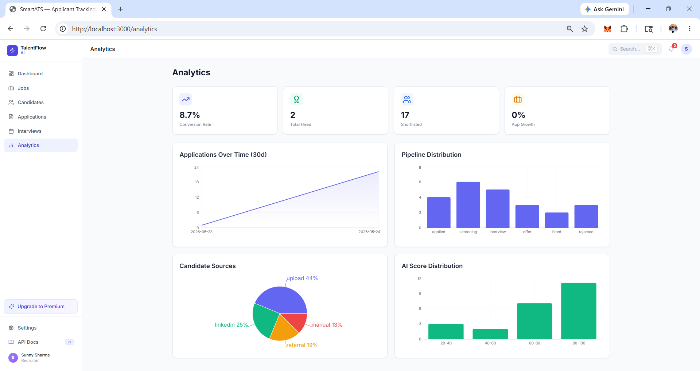
*Analytics dashboard: top-line KPIs (Conversion Rate, Total Hired, Shortlisted, App Growth), Applications Over Time area chart, Pipeline Distribution bar chart, Candidate Sources pie chart (upload / LinkedIn / referral / manual), and AI Score Distribution histogram.*

---

### Premium Upgrade
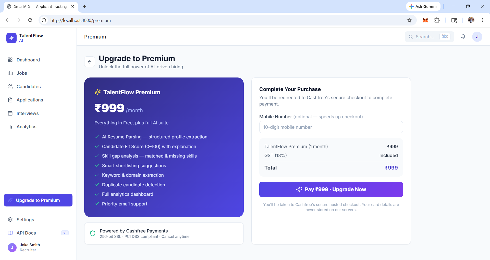
*Premium upgrade page — TalentFlow Premium plan card (₹999/month) listing all AI features (resume parsing, fit scores, skill gap analysis, smart shortlisting, keyword extraction, duplicate detection, full analytics, priority support), with a purchase panel powered by Cashfree Payments.*

---

### Cashfree Checkout
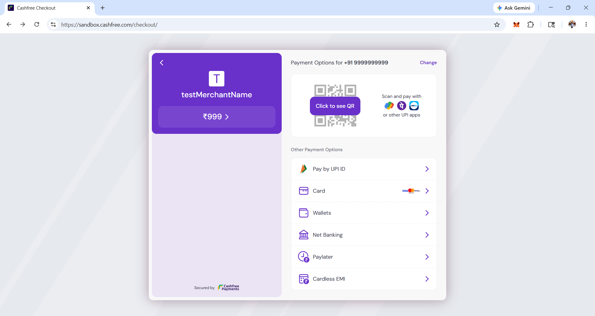
*Cashfree sandbox checkout showing ₹999 order — UPI QR, Pay by UPI ID, Card (Visa/Mastercard/RuPay), Wallets, Net Banking, Paylater, and Cardless EMI options.*

---

### Mobile — Dashboard
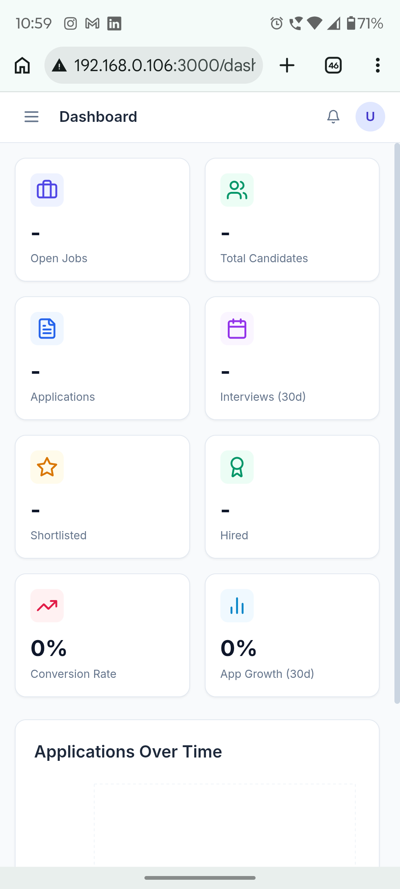
*Fully responsive mobile dashboard (390 px) — 2-column metric grid (Open Jobs, Total Candidates, Applications, Interviews, Shortlisted, Hired, Conversion Rate, App Growth) and Applications Over Time chart.*

---

### Mobile — Sidebar Navigation
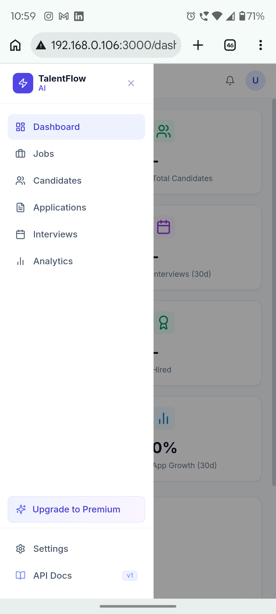
*Slide-in sidebar on mobile showing the TalentFlow AI logo, all nav items (Dashboard, Jobs, Candidates, Applications, Interviews, Analytics), Upgrade to Premium CTA, Settings, and API Docs.*

---

## Tech Stack

### Frontend
- **Next.js 14** (App Router, TypeScript)
- **TanStack Query v5** — server state & caching
- **Zustand** — auth state
- **Tailwind CSS** — utility-first styling
- **Recharts** — analytics charts
- **Axios** — HTTP client
- **Lucide React** — icons

### Backend
- **Node.js + Express.js** — REST API gateway
- **MongoDB + Mongoose** — database & ODM
- **JWT** — authentication
- **bcryptjs** — password hashing
- **Multer** — resume file uploads (PDF, DOCX)
- **Nodemailer** — email automation (Gmail SMTP)
- **Cashfree Payments** — premium subscription checkout

### AI Service
- **FastAPI** (Python) — AI microservice
- **Groq** (llama-3.3-70b) — primary LLM provider (ultra-fast)
- **OpenRouter** (llama-3.3-70b) — fallback LLM provider
- Resume parsing, candidate scoring, keyword extraction, job matching

### Infrastructure
- **Railway** — backend API gateway + AI service hosting
- **Vercel** — frontend hosting
- **MongoDB Atlas** — managed cloud database
- **Docker + Docker Compose** — containerised local development

---

## Architecture

```
┌─────────────────────────────────────────────────────────┐
│                     Browser / Mobile                      │
│   Next.js 14 — talent-flow-ai-the-sunny-sharma.vercel.app│
└───────────────────────┬─────────────────────────────────┘
                        │ REST (Axios)
┌───────────────────────▼─────────────────────────────────┐
│      Express.js API Gateway — Railway (Port 5000)         │
│   Auth · Jobs · Candidates · Applications · Analytics    │
│   Interviews · Notifications · Payments                  │
└──────────┬──────────────────────────┬───────────────────┘
           │ Mongoose                  │ HTTP (axios)
┌──────────▼──────────┐  ┌────────────▼──────────────────┐
│   MongoDB Atlas     │  │  FastAPI AI Service — Railway  │
│   smartats database │  │  /parse-resume                │
└─────────────────────┘  │  /score-candidate             │
                         │  /match-jobs                  │
                         │  /keywords                    │
                         └───────────────────────────────┘
```

---

## Quick Start (Docker — recommended for local dev)

### Prerequisites
- Docker Desktop installed and running
- Git

### 1. Clone the repo

```bash
git clone https://github.com/your-username/smart-ats.git
cd smart-ats
```

### 2. Create the `.env` file

```bash
cp .env.example .env
```

Minimum required to run locally:

```env
# JWT
JWT_SECRET=your_super_secret_jwt_key_here

# AI (get free keys at groq.com and openrouter.ai)
GROQ_API_KEY=gsk_xxxxxxxxxxxxxxxxxxxx
OPENROUTER_API_KEY=sk-or-xxxxxxxxxxxxxxxxxxxx

# Payments (get sandbox keys at merchant.cashfree.com)
CASHFREE_APP_ID=your_cashfree_app_id
CASHFREE_SECRET_KEY=your_cashfree_secret_key
CASHFREE_ENV=sandbox

# Email (optional — app works without it)
GMAIL_USER=your.gmail@gmail.com
GMAIL_APP_PASS=your_16_char_app_password

# URLs
CLIENT_URL=http://localhost:3000
API_URL=http://localhost:5000
```

### 3. Start all services

```bash
docker-compose up --build
```

This starts:
- `smart-ats-mongo` — MongoDB on port 27017
- `smart-ats-api` — Express API on port 5000
- `smart-ats-ai` — FastAPI AI service on port 8000

### 4. Start the frontend (separate terminal)

```bash
cd smart-ats-frontend
cp .env.local.example .env.local
npm install
npm run dev
```

Frontend runs at **http://localhost:3000**

### 5. Seed demo data

```bash
cd backend/api-gateway
node seed.js
```

Creates 3 user accounts, 3 jobs, 5 candidates, and sample applications with AI scores.

---

## Manual Setup (without Docker)

### Backend

```bash
cd backend/api-gateway
npm install
npm run dev        # starts on port 5000
```

### AI Service

```bash
cd backend/ai-service
pip install -r requirements.txt
uvicorn app.main:app --host 0.0.0.0 --port 8000 --reload
```

### Frontend

```bash
cd smart-ats-frontend
npm install
npm run dev        # starts on port 3000
```

---

## Environment Variables Reference

### API Gateway (`backend/api-gateway/.env`)

| Variable | Required | Description |
|---|---|---|
| `NODE_ENV` | ✅ | `production` or `development` |
| `PORT` | — | Server port (default: `5000`) |
| `MONGODB_URI` | ✅ | MongoDB Atlas connection string |
| `JWT_SECRET` | ✅ | Secret key for JWT signing (min 32 chars) |
| `JWT_EXPIRES_IN` | — | Token expiry (default: `7d`) |
| `AI_SERVICE_URL` | ✅ | URL of the FastAPI AI service |
| `CLIENT_URL` | ✅ | Frontend URL for CORS |
| `GMAIL_USER` | — | Gmail address for email automation |
| `GMAIL_APP_PASS` | — | Gmail 16-char App Password |
| `CASHFREE_APP_ID` | ✅ | Cashfree App ID |
| `CASHFREE_SECRET_KEY` | ✅ | Cashfree Secret Key |
| `CASHFREE_ENV` | — | `sandbox` (default) or `production` |

### AI Service (`backend/ai-service/.env`)

| Variable | Required | Description |
|---|---|---|
| `APP_URL` | — | Frontend URL |
| `GROQ_API_KEY` | ✅* | Groq API key (*or OpenRouter) |
| `OPENROUTER_API_KEY` | ✅* | OpenRouter key (fallback if Groq fails) |

### Frontend (`smart-ats-frontend/.env.local`)

| Variable | Required | Description |
|---|---|---|
| `NEXT_PUBLIC_API_URL` | ✅ | API Gateway base URL (e.g. `https://...railway.app/api`) |
| `NEXT_PUBLIC_URL` | ✅ | Frontend's own public URL |
| `NEXT_PUBLIC_APP_NAME` | — | App display name (default: `TalentFlow AI`) |
| `NEXT_PUBLIC_GOOGLE_CLIENT_ID` | — | Enables Google OAuth button |
| `NEXTAUTH_SECRET` | ✅ | Any random string for NextAuth |

---

## API Reference

Base URL: `https://ai-service-production-645a.up.railway.app/api`

All protected routes require: `Authorization: Bearer <token>`

### Auth
| Method | Endpoint | Auth | Description |
|---|---|---|---|
| POST | `/auth/register` | — | Register new user |
| POST | `/auth/login` | — | Login, returns JWT |
| POST | `/auth/google` | — | Google OAuth login |
| GET | `/auth/me` | ✅ | Get current user |
| GET | `/auth/users` | ✅ Admin | List all users |
| PATCH | `/auth/users/:id/role` | ✅ Admin | Change user role |

### Jobs
| Method | Endpoint | Auth | Description |
|---|---|---|---|
| GET | `/jobs` | ✅ | List jobs (paginated, filterable) |
| POST | `/jobs` | ✅ Recruiter+ | Create job |
| GET | `/jobs/:id` | ✅ | Get job detail |
| PUT | `/jobs/:id` | ✅ Recruiter+ | Update job |
| DELETE | `/jobs/:id` | ✅ Admin | Delete job |
| PATCH | `/jobs/:id/status` | ✅ Recruiter+ | Change status |

### Candidates
| Method | Endpoint | Auth | Description |
|---|---|---|---|
| GET | `/candidates` | ✅ | List candidates (search, filter, paginate) |
| POST | `/candidates` | ✅ | Create candidate manually |
| POST | `/candidates/upload-resume` | ✅ | Upload resume → AI parse |
| GET | `/candidates/:id` | ✅ | Get candidate + parsed profile |
| PUT | `/candidates/:id` | ✅ | Update candidate |
| DELETE | `/candidates/:id` | ✅ Recruiter+ | Delete candidate |

### Applications
| Method | Endpoint | Auth | Description |
|---|---|---|---|
| GET | `/applications` | ✅ | List applications (filter by jobId, stage, score) |
| POST | `/applications` | ✅ | Apply candidate to job |
| GET | `/applications/:id` | ✅ | Application detail with AI score |
| PATCH | `/applications/:id/stage` | ✅ | Move pipeline stage |
| PATCH | `/applications/:id/shortlist` | ✅ | Toggle shortlist |
| POST | `/applications/:id/score` | ✅ | Trigger AI scoring |

### Interviews
| Method | Endpoint | Auth | Description |
|---|---|---|---|
| GET | `/interviews` | ✅ | List interviews |
| POST | `/interviews` | ✅ | Schedule interview (sends email) |
| PATCH | `/interviews/:id/status` | ✅ | Update status |
| POST | `/interviews/:id/feedback` | ✅ | Submit interview feedback |

### Analytics
| Method | Endpoint | Auth | Description |
|---|---|---|---|
| GET | `/analytics/overview` | ✅ | KPIs: total jobs, candidates, conversion rate |
| GET | `/analytics/pipeline` | ✅ | Stage distribution |
| GET | `/analytics/applications-over-time` | ✅ | Daily app counts (last 30d) |
| GET | `/analytics/ai-scores` | ✅ | AI score distribution + recommendations |
| GET | `/analytics/source-breakdown` | ✅ | Candidate source breakdown |

### Notifications
| Method | Endpoint | Auth | Description |
|---|---|---|---|
| GET | `/notifications` | ✅ | List notifications + unread count |
| PATCH | `/notifications/read-all` | ✅ | Mark all read |
| PATCH | `/notifications/:id/read` | ✅ | Mark single read |
| DELETE | `/notifications/:id` | ✅ | Delete notification |

### Payments
| Method | Endpoint | Auth | Description |
|---|---|---|---|
| POST | `/payments/create-order` | ✅ | Create Cashfree order (₹999) |
| POST | `/payments/verify` | ✅ | Verify payment, grant premium |
| GET | `/payments/status` | ✅ | Check premium status |
| POST | `/payments/webhook` | — | Cashfree webhook (signed) |

### AI Service (FastAPI — internal)
| Method | Endpoint | Description |
|---|---|---|
| POST | `/parse-resume` | Extract structured profile from resume text |
| POST | `/score-candidate` | Score 0–100 against a job |
| POST | `/match-jobs` | Rank jobs by candidate fit |
| POST | `/keywords` | Extract skills and keywords |
| GET | `/health` | Liveness check + provider status |

---

## Features

### Part 1 — Core ATS Platform
- ✅ User authentication with JWT + Google OAuth
- ✅ Role-based access control (Admin, Recruiter, Hiring Manager)
- ✅ Job posting management (CRUD, status, departments, skills)
- ✅ AI resume parsing with PDF/DOCX extraction
- ✅ Candidate pipeline tracking with stage history
- ✅ Semantic candidate matching via LLM
- ✅ Advanced search and filters across all entities
- ✅ Recruitment dashboard with live KPIs
- ✅ Interview scheduling with email notifications
- ✅ Real-time notification bell with unread badge (30s polling)
- ✅ Responsive UI for desktop (1440px) and mobile (390px)

### Part 2 — AI Intelligence Module
- ✅ Resume parsing using Groq LLM (llama-3.3-70b) with OpenRouter fallback
- ✅ Skill matching — matched skills and missing skills per application
- ✅ Candidate ranking by AI relevance score (0–100)
- ✅ Explainable AI — plain-English explanation + highlights per score
- ✅ Keyword extraction from resumes
- ✅ Fit score: weighted avg (skill 40% + experience 35% + education 25%)
- ✅ Duplicate candidate detection via MD5 fingerprint (name + email)
- ✅ Smart shortlisting — AI suggests top candidates (score > 70) per job

### Part 3 — Premium Version
- ✅ Landing page with required copy ("Hire Smarter with AI", etc.)
- ✅ Free vs Premium comparison table
- ✅ Cashfree payment integration (₹999/month)
- ✅ Premium-gated AI features

---

## Folder Structure

```
smart-ats/
├── backend/
│   ├── api-gateway/          # Express.js REST API
│   │   ├── src/
│   │   │   ├── controllers/  # Route handlers
│   │   │   ├── models/       # Mongoose schemas
│   │   │   ├── routes/       # Express routers
│   │   │   ├── middleware/   # Auth, upload
│   │   │   └── utils/        # DB, email helpers
│   │   ├── seed.js           # Demo data seeder
│   │   └── package.json
│   └── ai-service/           # FastAPI Python microservice
│       ├── app/main.py       # AI endpoints
│       └── requirements.txt
├── smart-ats-frontend/       # Next.js 14 app
│   ├── src/
│   │   ├── app/              # App Router pages
│   │   ├── components/       # Reusable components
│   │   ├── lib/              # API client, auth store, utils
│   │   └── types/            # TypeScript interfaces
│   └── package.json
├── screenshots/              # UI screenshots for submission
├── docker-compose.yml        # Orchestrates local services
├── .env.example              # Environment variable template
└── README.md
```

---

## Getting Free API Keys

| Service | URL | Free Tier |
|---|---|---|
| **Groq** (AI) | https://console.groq.com | 14,400 requests/day |
| **OpenRouter** (AI fallback) | https://openrouter.ai | Free models available |
| **Cashfree** (payments) | https://merchant.cashfree.com | Full sandbox |
| **Gmail App Password** | https://myaccount.google.com/apppasswords | Free |
| **MongoDB Atlas** | https://www.mongodb.com/atlas | 512 MB free tier |
| **Railway** | https://railway.app | $5 free credit/month |
| **Vercel** | https://vercel.com | Generous free tier |

---

## Deployment

| Service | Platform | Notes |
|---|---|---|
| Frontend | Vercel | Auto-deploys on push to `main` |
| API Gateway | Railway | Set all env vars from the reference table above |
| AI Service | Railway | Set `GROQ_API_KEY` + `OPENROUTER_API_KEY` |
| Database | MongoDB Atlas | Free M0 cluster; whitelist `0.0.0.0/0` for Railway |

---

## Submission Notes

- **Assignment:** Namaah Pvt Ltd — Full Stack Intern Technical Assignment
- **Platform:** Smart ATS Hiring Suite / TalentFlow AI
- **Stack:** Next.js 14 + Express.js + MongoDB Atlas + FastAPI + Groq AI
- **Deployed Frontend:** https://talent-flow-ai-the-sunny-sharma.vercel.app
- **Deployed API:** https://ai-service-production-645a.up.railway.app
- **Submitted by:** Sunny Yogendra Sharma
- **Date:** May 2026